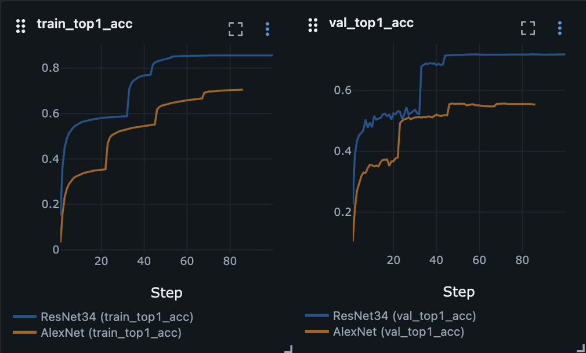
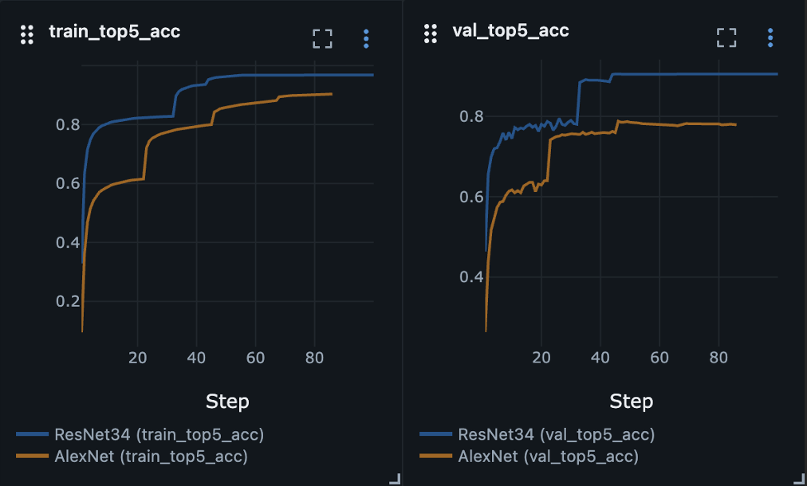
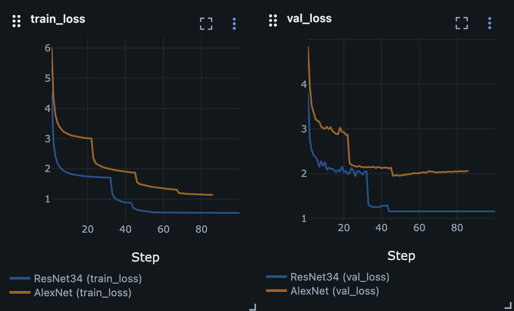

# Image classification

This section contains my image classification experiments while studying CNNs.
The goal is to understand CNN building blocks, reproduce baseline training pipelines, and gradually move from simple
tutorial-level models to classic architectures such as AlexNet and later ResNet.

## CIFAR-10

This is my baseline CNN experiment based on the official PyTorch tutorial.

### Goal

Understand the full image classification workflow in PyTorch on a simple dataset:

* Dataset and data loader setup.
* CNN forward pass.
* Loss computation.
* Optimizer step.
* Evaluation on a test set.

### What I did

* Reproduced the official PyTorch CIFAR-10 classification tutorial.
* Trained a small handwritten CNN.
* Used this experiment to understand the end-to-end training loop for image classification.

### Training

```bash
python3 pytorch/image_classification/train_simple_cnn.py
```

### Testing

```bash
python3 pytorch/image_classification/test_simple_cnn.py \
  --load_model_path artifacts/models/CIFAR10/simple-net_cifar10_epoch15_batch32_lr0.002_momentum0.9.pt
```

### Result

```text
Accuracy of the network on the 10000 test images: 63 %
```

Here I did not tune hyperparameters properly and simply kept the checkpoint with the lowest loss after 20 epochs.
Just understanding the basic PyTorch training pipeline for CNNs.

## ImageNet1000

This experiment was my second step after the simplest CNN baseline and studying the LeNet (1998) architecture.

### Goal

Understand a classic large-scale CNN architecture and train it myself on ImageNet.

### Hardware used

I used my PC with the next hardware for training:

* GPU - 1x Nvidia RTX 3060 12 Gb.
* CPU - AMD Ryzen 9 7900X.
* RAM - 2x32 Gb DDR5.
* SSD - Samsung 990 PRO 2 TB.
* OS - Ubuntu 24.04 LTS.

### What I did

* Researched the AlexNet and ResNet architectures, its tensor flow and key differences.
* Used `torchvision`implementations to train both of them.
* Built a train/validation pipeline for ImageNet-1000.
* Implemented preprocessing, training loop, validation loop, metrics logging, and LR scheduling.
* Implemented test script which counts accuracy of prediction on validation set.

### AlexNet

#### Training

Default training configuration is defined directly in the script arguments.

```bash
python3 pytorch/image_classification/train_imagenet1000.py \
  --model AlexNet
```

Resume training example:

```bash
python3 pytorch/image_classification/train_imagenet1000.py \
  --model AlexNet \
  --resume_from artifacts/models/ImageNet-1000/AlexNet/alexnet_imagenet1000_best_batch128_lr0.01_momentum0.9.pt
```

#### Testing

```bash
python3 pytorch/image_classification/test_imagenet1000.py \
  --model AlexNet \
  --models_dir artifacts/models/ImageNet-1000/AlexNet
```

### ResNet

Models available for training are presented in `src/models/imagenet1000.py` in `models_dict`. For ResNet training I used
configuration as follows:

#### Training

```bash
python3 pytorch/image_classification/train_imagenet1000.py \
  --model ResNet34 \
  --batch_size 256 \
  --num_workers 6 \
  --epochs 100 \
  --lr 0.1 \
  --weight_decay 0.0001
```

More over I switched the scheduler to 'ReduceLROnPlateau' cause the [ResNet authors](https://arxiv.org/abs/1512.03385)
used the same way to reduce learning rate:

```text
    scheduler = ReduceLROnPlateau(
        optimizer,
        mode="min",
        factor=0.1,
        patience=5,
        threshold=0.001,
        threshold_mode="abs",
        min_lr=1e-5,
    )
```

I also decided to optimize not `val_loss` here, but `val_error` to make it a bit closer to authors paper.

```text
val_top1_error = 1.0 - val_top1_acc
scheduler.step(val_top1_error)
```

Resume training example:

```bash
python3 pytorch/image_classification/train_imagenet1000.py \
  --model ResNet34 \
  --resume_from artifacts/models/ImageNet-1000/ResNet/34/resnet34_imagenet1000_best_batch256_lr0.1_momentum0.9.pt
```

#### Testing

```bash
python3 pytorch/image_classification/test_imagenet1000.py \
  --model ResNet34 \
  --models_dir artifacts/models/ImageNet-1000/ResNet
```

### Result

#### Choose best model

<p align="center">
    
    
    
</p>

After approximately 47 epochs, AlexNet shows almost no improvement in `val_top1_acc`, even though `train_top1_acc`
continues to rise. Consequently, further training primarily improves performance on the training set but yields almost
no gains in generalization.

For ResNet34, the optimal checkpoint should be selected based on the maximum `val_top1_acc`; judging by the graph, this
occurs somewhere around the 45–60 epoch mark. If the values remain nearly identical after epoch 45, it is best
to choose the earliest checkpoint that achieves maximum—or near-maximum—validation accuracy.

#### Training time

AlexNet took around <b>20 minutes</b> per epoch and <b>30 hours</b> for 90 epochs.

ResNet34 took around <b>60 minutes</b> per epoch and almost <b>5 days</b> for 100 epochs.

This was not a strict historical reproduction of the original papers. I used the torchvision implementation and focused
on understanding the architecture, tensor flow, and the full training pipeline.

## Sources

1. [Training a Classifier](https://docs.pytorch.org/tutorials/beginner/blitz/cifar10_tutorial.html)
2. [ImageNet Large Scale Visual Recognition Challenge 2012 (ILSVRC2012)](https://www.image-net.org/challenges/LSVRC/2012/2012-downloads.php)
3. [ImageNet Classification with Deep Convolutional Neural Networks](https://papers.nips.cc/paper_files/paper/2012/hash/c399862d3b9d6b76c8436e924a68c45b-Abstract.html)
4. [One weird trick for parallelizing convolutional neural networks](https://arxiv.org/abs/1404.5997)
5. [Deep Residual Learning for Image Recognition](https://arxiv.org/abs/1512.03385)
