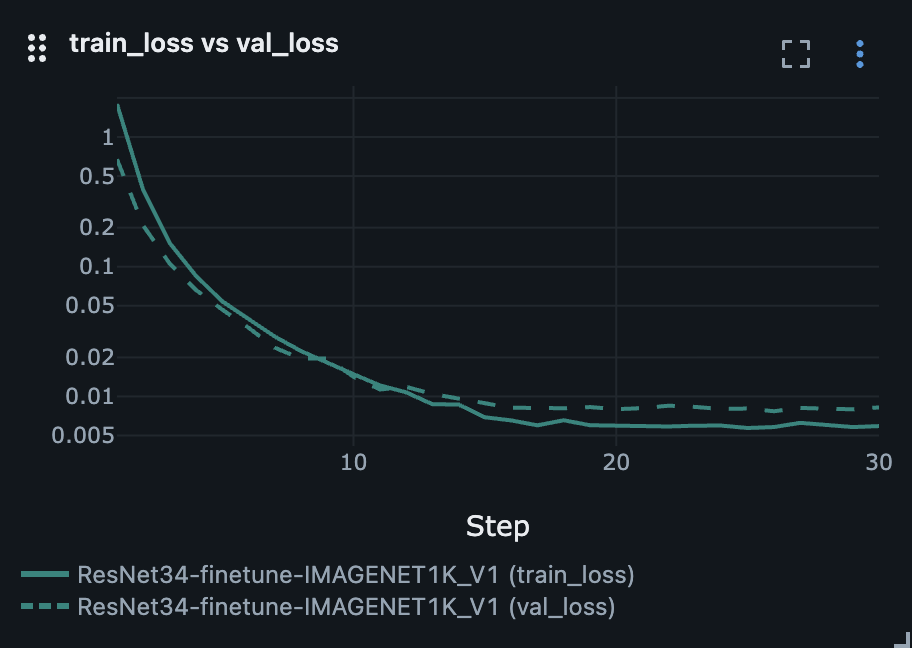
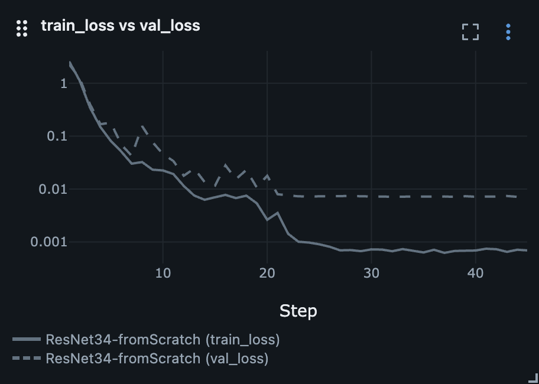
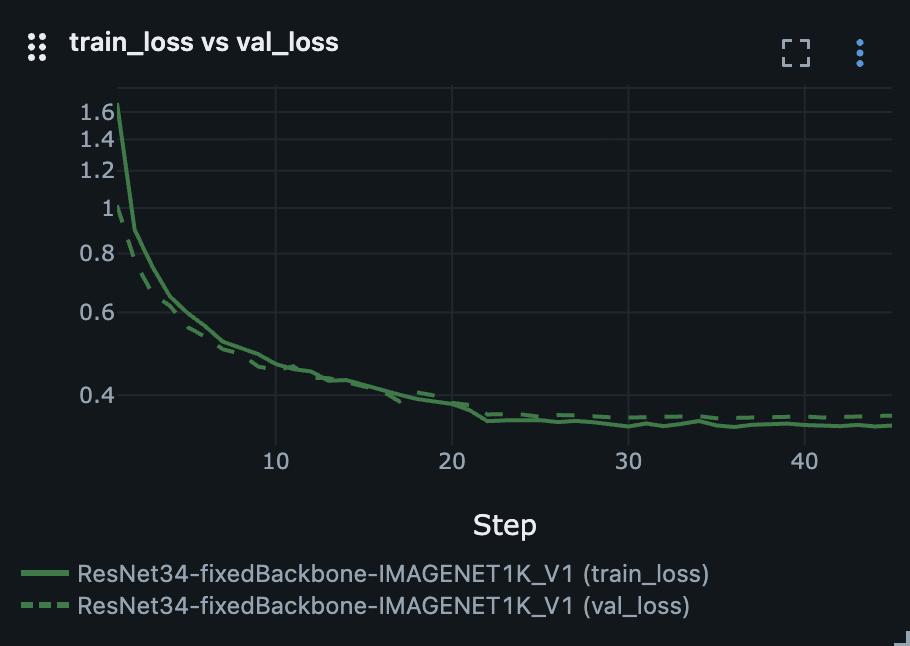
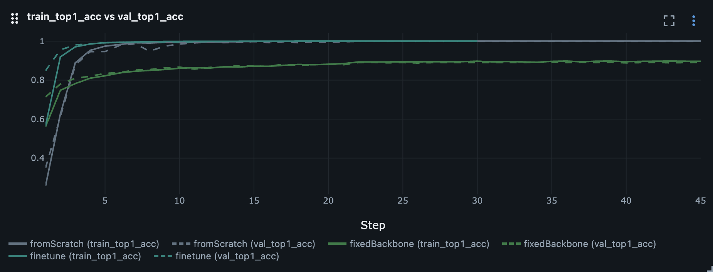

# GTSRB

This experiment was my third step after understanding a classic large-scale CNN architecture and training it myself on
ImageNet-1000.

## Goal

Compare different transfer learning strategies on the GTSRB dataset using ResNet34. The experiments evaluate whether
ImageNet-pretrained weights improve final accuracy, convergence speed, and training efficiency compared to training the
same architecture from scratch.

## What I did

* Refreshed what transfer learning is.
* Researched how to do transfer learning using PyTorch.
* Used `torchvision` implementation of ResNet34 with IMAGENET1K_V1 weights to make three experiments:
    - Finetuning full model.
    - Use a backbone as fixed feature extractor (freezing every layer except the fully connected layer).
    - Train full net from scratch.
* Made conclusions about results of training and benefit of transfer learning for the task.

Since GTSRB has only `train` and `test` splits, I split the original train split into `train` and `val` subsets.
The original `test` split was left for final evaluation.

## Training

Finetuning full model:

```bash
python3 pytorch/image_classification/gtsrb/train.py \
  --model ResNet34 \
  --num_workers 6 \
  --epochs 30 \
  --lr 0.001 \
  --weight_decay 0.0001 \
  --patience 3 \
  --run_name finetune
```

Fixed backbone as feature extractor (frozen layers):

```bash
python3 pytorch/image_classification/gtsrb/train.py \
  --model ResNet34 \
  --lr 0.01 \
  --epochs 45 \
  --weight_decay 0.0001 \
  --patience 3 \
  --run_name fixedBackbone
```

Training from scratch:

```bash
python3 pytorch/image_classification/gtsrb/train.py \
  --model ResNet34 \
  --epochs 45 \
  --weight_decay 0.0001 \
  --patience 5 \
  --run_name fromScratch
```

### Testing

```bash
python3 pytorch/image_classification/gtsrb/test.py \
  --model ResNet34 \
  --models_dir artifacts/models/GTSRB/ResNet/34
```

## Results

<p align="center">
    
    
    
</p>

### Accuracy curves

The top-1 accuracy curves show that fine-tuning and training from scratch quickly reached very high validation 
accuracy, while the frozen-backbone model plateaued noticeably lower. This confirms that freezing the feature extractor 
limited the model's ability to adapt to traffic sign classification.

<p align="center">
    
</p>

I did not add the top-5 here. This is not a very revealing metric for GTSRB, because there are only 43 classes, and
getting into the top 5 is much easier than getting into the top 1.

### Conclusions

**Finetuning pretrained weights.**
Finetuning showed the best result because ImageNet pretraining provided useful general visual features, while updating
all layers allowed the model to adapt them to the traffic sign domain. The train and validation losses decreased
together and stayed close, which indicates stable training without noticeable overfitting.

**Training from scratch.**
ResNet34 reached high accuracy on GTSRB because traffic signs have clear visual patterns such as shapes, colors, digits,
and symbols. However, the model converged slightly slower than the fine-tuned version and reached a few percentage
points lower accuracy. After about 20 epochs, the train loss continued to decrease while the validation loss reached
a plateau, which suggests the beginning of overfitting.

**Frozen backbone.**
Freezing the convolutional layers made training 3 times faster, but significantly limited the final accuracy. This
suggests that fixed ImageNet features are not sufficient for GTSRB, since traffic signs differ from the everyday object
images used in ImageNet. The model did not show strong overfitting, but both train and validation losses stayed
relatively high, which indicates underfitting caused by the frozen feature extractor.

### Test accuracy table

| # | Experiment                                | Test Accuracy | Convergence                                          | Training time per epoch | Short Summary                                                                                                       |
|--:|-------------------------------------------|--------------:|------------------------------------------------------|-------------------------|---------------------------------------------------------------------------------------------------------------------|
| 1 | Finetuning pretrained ResNet34            |    **~0.957** | Fastest reaching plateau                             | 1.5 min                 | Best result: pretrained ImageNet weights gave a strong initialization and the model adapted well to GTSRB.          |
| 2 | ResNet34 trained from scratch             |        ~0.932 | Slightly slower than finetuning                      | 1.5 min                 | The model learned the task well without pretraining, but achieved slightly lower accuracy than the finetuned model. |
| 3 | Frozen backbone + trained classifier head |         ~0.71 | Fast in terms of computation, but limited in quality | 0.5 min                 | The fixed ImageNet features were only partially useful and could not fully adapt to traffic sign images.            |

So the best experiment is **finetuning pretrained ResNet34**.

### Training time

Finetuning took about **1 minute 26 seconds** per epoch and **37.9 minutes** for 30 epochs.

Training from scratch had approximately the same training time per epoch, since all model parameters were updated in
both experiments.

Training with frozen layers took only **30 seconds** per epoch and almost **22.4 minutes** for 45 epochs, which is much
faster than finetuning. This is expected because we calculate gradients only for last fully connected layer.

## What's next

It would be better to improve in future works or right here:

* Move training parameters to a configuration file:
    - Optimizer with params.
    - Scheduler with params.
    - Probably some args too.
* Log the config file as an artifact into MLflow to make experiments easier to reproduce.
* Change template of weights naming for MLflow.
* Think about how to unify training and testing scripts like for ImageNet and GTSRB because they have code duplication.

## Sources

1. [Dataset - German Traffic Sign Recognition Benchmark (GTSRB)](https://benchmark.ini.rub.de/gtsrb_dataset.html)
2. [Transfer Learning](https://cs231n.github.io/transfer-learning/)
3. [Transfer Learning for Computer Vision Tutorial](https://docs.pytorch.org/tutorials/beginner/transfer_learning_tutorial.html)
