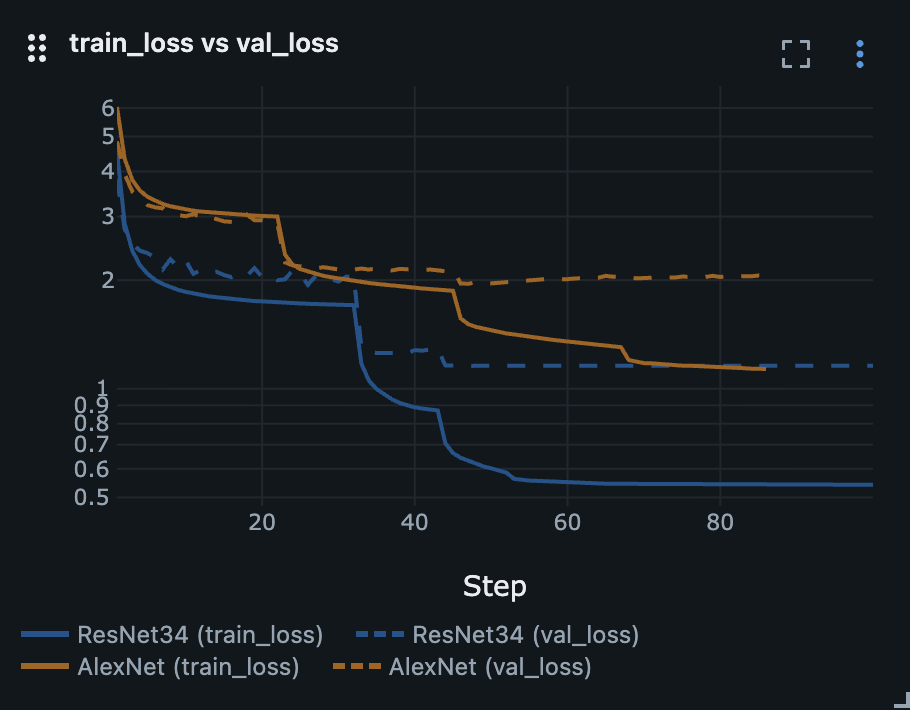
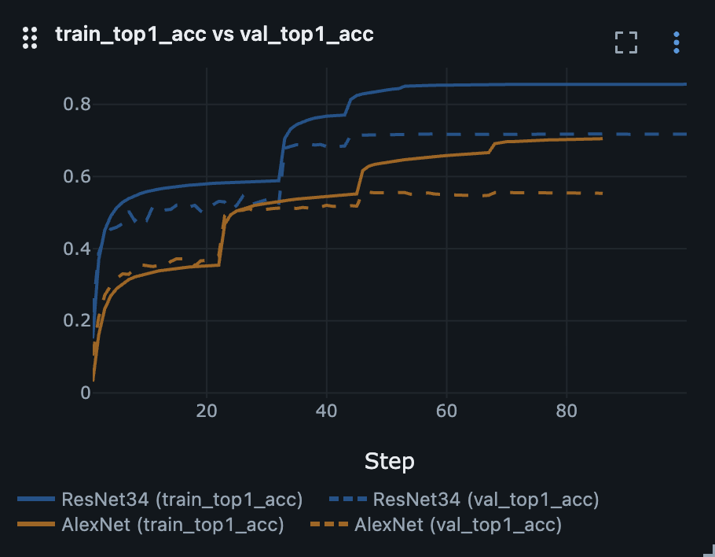
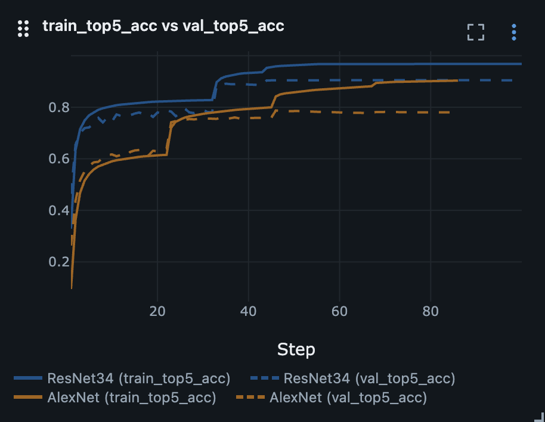

# ImageNet-1000

This experiment was my second step after building the simplest CNN baseline and studying the LeNet-5 architecture.

## Goal

Understand a classic large-scale CNN architecture and train it myself on ImageNet.

## Experiment checklist

* [x] Researched the AlexNet and ResNet architectures, their tensor flow, and key differences.
* [x] Used `torchvision` implementations to train both of them.
* [x] Built a train/validation pipeline for ImageNet-1000.
* [x] Implemented preprocessing, training loop, validation loop, metrics logging, and LR scheduling.
* [x] Implemented an evaluation script that computes accuracy on the validation set.

I did not create an additional validation split from the ImageNet training set. I used the standard train split for
training and the official validation split for evaluation, since ImageNet test labels are not publicly available.

## AlexNet

### Training

Default training configuration is defined directly in the script arguments.

```bash
python3 pytorch/image_classification/imagenet1000/train.py \
  --model AlexNet
```

Resume training example:

```bash
python3 pytorch/image_classification/imagenet1000/train.py \
  --model AlexNet \
  --resume_from artifacts/models/ImageNet-1000/AlexNet/alexnet_imagenet1000_best_batch128_lr0.01_momentum0.9.pt
```

### Testing

```bash
python3 pytorch/image_classification/imagenet1000/test.py \
  --model AlexNet \
  --models_dir artifacts/models/ImageNet-1000/AlexNet
```

## ResNet

For ResNet training I used configuration as follows:

### Training

```bash
python3 pytorch/image_classification/imagenet1000/train.py \
  --model ResNet34 \
  --batch_size 256 \
  --num_workers 6 \
  --epochs 100 \
  --lr 0.1 \
  --weight_decay 0.0001
```

Moreover, I switched the scheduler to `ReduceLROnPlateau`, because the [ResNet paper](https://arxiv.org/abs/1512.03385)
follows a similar idea of reducing the learning rate when the error stops improving:

```text
    scheduler = ReduceLROnPlateau(
        optimizer,
        mode="min",
        factor=0.1,
        patience=5,
        threshold=0.001,
        threshold_mode="abs",
        min_lr=1e-5,
    )
```

I also decided to optimize not `val_loss` here, but `val_error` to make it a bit closer to authors paper.

```text
val_top1_error = 1.0 - val_top1_acc
scheduler.step(val_top1_error)
```

Resume training example:

```bash
python3 pytorch/image_classification/imagenet1000/train.py \
  --model ResNet34 \
  --resume_from artifacts/models/ImageNet-1000/ResNet/34/resnet34_imagenet1000_best_batch256_lr0.1_momentum0.9.pt
```

### Testing

```bash
python3 pytorch/image_classification/imagenet1000/test.py \
  --model ResNet34 \
  --models_dir artifacts/models/ImageNet-1000/ResNet/34
```

## Results

### Choose best model

The main goal of this experiment was to train classic large-scale CNN architectures on ImageNet-1000 and go through the
full training pipeline: preprocessing, training, validation, checkpointing, metrics logging, and learning rate
scheduling.

<p align="center">
    
    
    
</p>

**AlexNet.**
AlexNet was useful as a first classic ImageNet-scale CNN architecture. It trained successfully, but reached a lower
validation accuracy and plateaued earlier than ResNet34.

**ResNet34.**
ResNet34 showed better validation accuracy and lower validation loss than AlexNet. The metric jumps after learning rate
drops also helped to observe how LR scheduling affects large-scale CNN training.

**Overall.**
ResNet34 performed better in terms of both top-1 and top-5 accuracy, but both models showed signs of overfitting. The
main result of the experiment was practical experience with training, validating, comparing, and monitoring classic CNN
architectures on a large-scale dataset.

### Training time

AlexNet took around **20 minutes** per epoch and **30 hours** for 90 epochs.

ResNet34 took around **60 minutes** per epoch and almost **5 days** for 100 epochs.

This was not a strict historical reproduction of the original papers. I used the torchvision implementation and focused
on understanding the architecture, tensor flow, and the full training pipeline.

## Sources

1. [ImageNet Large Scale Visual Recognition Challenge 2012 (ILSVRC2012)](https://www.image-net.org/challenges/LSVRC/2012/2012-downloads.php)
2. [ImageNet Classification with Deep Convolutional Neural Networks](https://papers.nips.cc/paper_files/paper/2012/hash/c399862d3b9d6b76c8436e924a68c45b-Abstract.html)
3. [One weird trick for parallelizing convolutional neural networks](https://arxiv.org/abs/1404.5997)
4. [Deep Residual Learning for Image Recognition](https://arxiv.org/abs/1512.03385)
