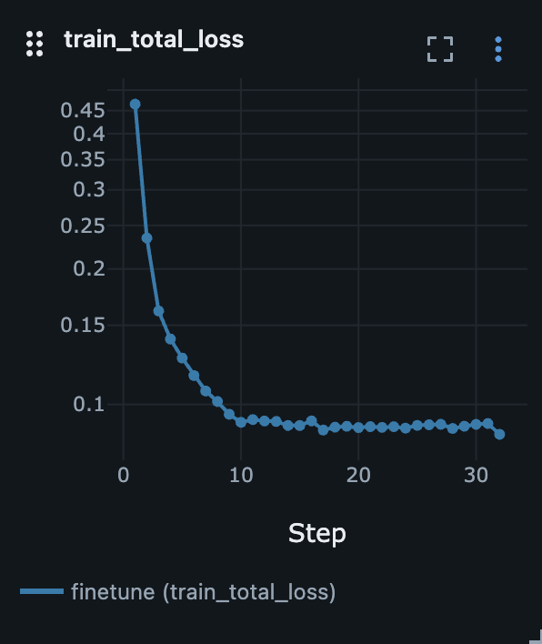
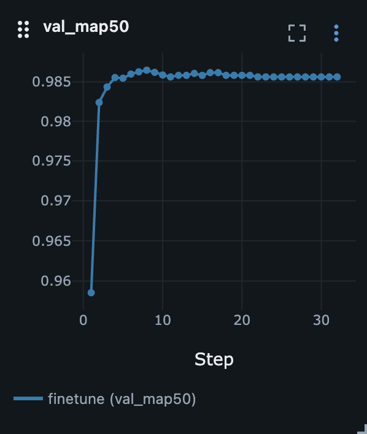
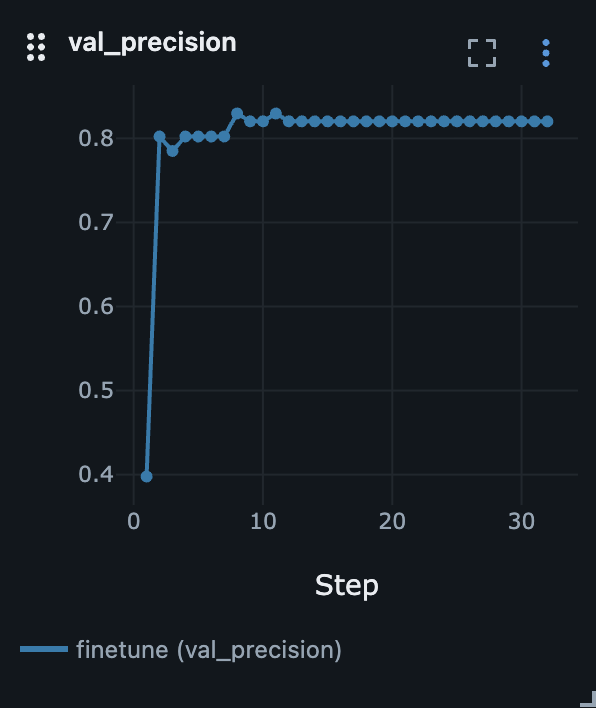
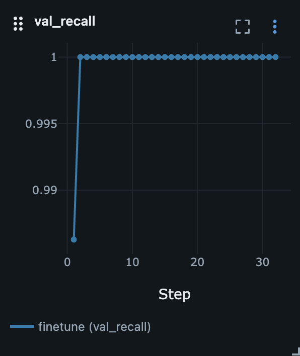
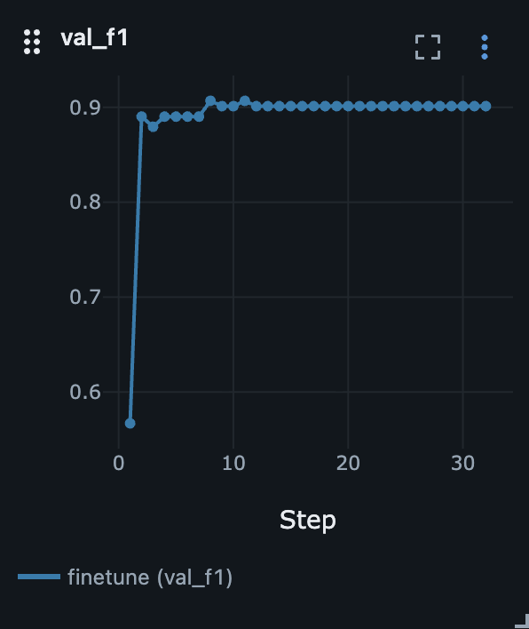

# Penn-Fudan Database for Pedestrian Detection

In this experiment I do finetuning of Fast R-CNN using
[Penn-Fudan Database for Pedestrian Detection and Segmentation](https://www.cis.upenn.edu/~jshi/ped_html). The dataset
contains bounding boxes annotation and masks. Despite this I will use only bounding boxes because the experiment is
about object detection only.

## Goal

Understand the main components of a two-stage object detector, fine-tune pretrained Faster R-CNN on the Penn-Fudan
dataset, and implement the main object detection metrics manually.

## Experiment checklist

* [x] Research the Faster R-CNN architecture.
* [x] Understand how object detection differs from image classification: model inputs, targets, outputs and evaluation.
* [ ] Refresh loss functions.
* [x] Understand the main parts of a two-stage detector: backbone, RPN, RoI pooling/align, classification head, and box
  regression head.
* [x] Refresh basic object detection concepts: bounding boxes, labels, objectness score, confidence score, IoU and
  anchors.
* [ ] Refresh NMS concepts.
* [x] Research basic object detection metrics and choose the main one for evaluation.
* [x] Understand `collate_fn` in the data loader.
* [x] Load images, bounding boxes, labels, and image IDs in the format expected by the torchvision detection model.
* [x] Configure detection transforms and data loaders.
* [x] Fine-tune Faster R-CNN on the Penn-Fudan dataset.
* [x] Evaluate the model using the chosen object detection metric.
* [ ] Visualize predictions with bounding boxes, confidence scores, and ground-truth boxes.
* [ ] Analyze typical errors: missed pedestrians, false positives, duplicate boxes, and inaccurate localization.
* [ ] Write conclusions about Faster R-CNN and object detection metrics.

Since Penn-Fudan does not provide predefined train and validation splits, I split the dataset into `train` and `val`
subsets using an 80/20 ratio and a fixed random seed.

## Training

Fine-tuning the full model:

```bash
python3 pytorch/object_detection/penn-fudan-pedestrian/train.py \
  --lr 0.001 \
  --epochs 32 \
  --step_size 8 \
  --run_name finetune \
  --mlflow_address http://host.docker.internal:8081
```

## Evaluation

```bash
python3 pytorch/object_detection/penn-fudan-pedestrian/eval.py
```

## Results

I studied the evolution from R-CNN to Faster R-CNN and learned how the backbone, FPN, RPN, RoI Align, classification
head, and box regression head form a two-stage detector and fine-tuned Faster R-CNN on Penn-Fudan.

I also refreshed and manually implemented TP, FP, FN, precision, recall, F1, PR curve, AP, and mAP.

### Faster R-CNN

<p align="center"> 
    
    
</p>

The training loss decreased rapidly during the first epochs and then stabilized around 0.09. At the same time,
validation mAP50 quickly reached approximately 0.989 and remained stable, indicating fast convergence of the pretrained
Faster R-CNN on Penn-Fudan.

Since the dataset contains only one foreground class, person, mAP50 is equal to AP50 in this experiment.

<p align="center"> 
    
    
    
</p>

At a score threshold of 0.5, recall reached 1.0, while precision stabilized around 0.82 and F1 around 0.90. This
indicates that the model detects nearly all pedestrians, while most remaining errors are false-positive detections.

Overall, the model converged quickly and achieved strong validation results. However, Penn-Fudan is a small dataset,
so the experiment primarily demonstrates successful fine-tuning and manual implementation of object detection metrics
rather than robust real-world performance.

### Evaluating

The model was first evaluated at a fixed IoU threshold of 0.5 using several confidence thresholds.

#### Fixed-threshold metrics

| Score threshold | IoU threshold | Precision | Recall    | F1        |
|-----------------|--------------:|-----------|-----------|-----------|
| 0.5             |           0.5 | 0.82      | **1.000** | 0.901     |
| 0.8             |           0.5 | 0.878     | 0.986     | 0.929     |
| 0.9             |           0.5 | **0.91**  | 0.973     | **0.940** |

Increasing the score threshold from 0.5 to 0.9 improved precision from 0.820 to 0.910, while recall decreased only
slightly from 1.000 to 0.973. This means that many low-confidence predictions were false positives. Removing them made
the predictions cleaner without causing a significant increase in missed pedestrians.

Among the tested thresholds, 0.9 achieved the best F1 score.

#### PR-curve

<p align="center"> 
     
</p>

The PR curve shows that precision remains close to 1.0 over most of the recall range. This means that the model ranks
correct pedestrian detections above most false positives.

After recall reaches 1.0, additional low-confidence detections cannot find new ground-truth objects. They are therefore
counted mostly as false positives, which produces the vertical drop at the right side of the curve. This part of the
curve is expected. Recall remains equal to 1.0, while precision decreases as more low-confidence false positives are
included.

#### Average Precision

At an IoU threshold of 0.5, the model achieved:

```text
AP50 = 0.9887
```

AP summarizes the complete precision-recall curve into one value. The high AP50 indicates that true-positive detections
are generally assigned higher confidence scores than false-positive detections.

The manual implementation uses non-interpolated AP:

$AP = \sum_{n} \left(R_n - R_{n-1}\right) P_n$

#### Mean Average Precision

Penn-Fudan contains only one foreground class: `person`.

Therefore, at a fixed IoU threshold:

```
mAP50 = AP50_person
```

For this experiment:

```
mAP50 = 0.9887
```

In a multi-class dataset, AP would be calculated separately for each class and then averaged. In COCO-style evaluation,
AP is additionally averaged over IoU thresholds from 0.50 to 0.95.

## Conclusions

I fine-tuned Faster R-CNN on Penn-Fudan and implemented the main object detection metrics manually: TP, FP, FN,
Precision, Recall, F1, PR-curve, AP, and mAP.

Increasing the score threshold improved precision with only a small drop in recall. At `IoU=0.5`, the model achieved
`AP50=0.9887`, which shows that correct pedestrian detections are generally ranked above false positives.

Since Penn-Fudan has only one foreground class, `mAP50` is equal to `AP50` in this experiment.

## What's next

* Compare the manual AP50 implementation with TorchMetrics.
* Calculate COCO-style mAP50-95, mAP75, and mAR.
* Visualize false positives, false negatives, duplicate detections, and inaccurate bounding boxes.

## Sources

1. [Rich feature hierarchies for accurate object detection and semantic segmentation](https://arxiv.org/abs/1311.2524)
2. [Fast R-CNN](https://arxiv.org/abs/1504.08083)
3. [Faster R-CNN: Towards Real-Time Object Detection with Region Proposal Networks](https://arxiv.org/abs/1506.01497)
4. [Penn-Fudan Database for Pedestrian Detection and Segmentation](https://www.cis.upenn.edu/~jshi/ped_html/)
5. [TorchVision Object Detection Finetuning Tutorial](https://docs.pytorch.org/tutorials/intermediate/torchvision_tutorial.html)
6. [mAP (mean Average Precision) for Object Detection](https://jonathan-hui.medium.com/map-mean-average-precision-for-object-detection-45c121a31173)
7. [The Complete Guide to Object Detection Evaluation Metrics: From IoU to mAP and More](https://medium.com/@prathameshamrutkar3/the-complete-guide-to-object-detection-evaluation-metrics-from-iou-to-map-and-more-1a23c0ea3c9d)
8. [Object Detection Metrics](https://blog.roboflow.com/object-detection-metrics/)
9. [Precision-Recall](https://scikit-learn.org/stable/auto_examples/model_selection/plot_precision_recall.html)
